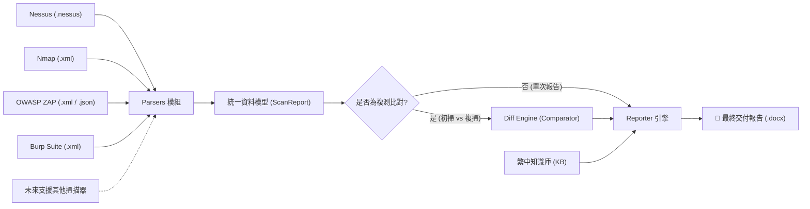

# 🕸️ VulnWeaver (弱點編織者)

<p align="center">
  <strong>專為資安健診、紅藍隊演練、ISMS 稽核與政府標案設計的弱點報告與複掃比對自動化引擎。</strong>
</p>

<p align="center">
  
  
  
  
  <a href="https://github.com/NickYCLin/vuln-weaver/actions/workflows/ci.yml"></a>
</p>

<p align="center">
  <a href="https://nickyclin.github.io/vuln-weaver/"><strong>🌐 立即使用 Web Lite 線上版 (免安裝、純瀏覽器本地解析)</strong></a>
</p>

---

## 📖 專案緣起 (Background)

在資訊安全顧問輔導、滲透測試與資安健診實務中，工程師往往面臨以下痛點：
- **大量人工作業**：使用 Nessus、OpenVAS、Nmap 掃描後，需手動將數百筆漏洞貼至 Word/Excel 範本。
- **語言隔閡**：國際掃描器產出的漏洞描述與建議均為英文，但公部門、學校及企業**驗收強制要求全繁體中文**。
- **複測核銷困難**：政府標案必定要求「改善後複掃」，人工逐筆核對哪些已修補、哪些仍存在，極度費時且容易出錯。

**VulnWeaver** 旨在解放資安顧問與工程師的時間，將散亂的掃描檔一鍵轉化為**排版專業、支援繁體中文、具備複掃比對**的標準交付報告。

---

## 🌟 核心特色 (Key Features)

- **⚡ 掃描結果解析**
  - CLI 支援 **Tenable Nessus (`.nessus`)**、**Nmap XML (`-oX` 輸出的 `.xml`)**、**OWASP ZAP 傳統報告（`.xml` / `.json`）** 與 **Burp Suite「Report issues」匯出的 `.xml`**，轉成統一資料模型。
  - `.xml` 會依根節點自動分辨是 Nmap、ZAP 還是 Burp，不需另外指定掃描器。
  - Web Lite 線上版支援同樣四種格式，解析與比對規則和 CLI 一致，全程在瀏覽器內完成。
  - Nmap 的開放通訊埠會列入主機清冊；只有 Telnet、過期 TLS 協定或明確回報 `VULNERABLE` 的 NSE 腳本會產生弱點項目。開放 FTP 埠本身不代表已檢出明文或匿名登入。
  - ZAP 與 Burp 報告以站台（主機 + 通訊埠）當作受影響對象，同一告警跨多個站台會合併成一筆並列出各站台；風險等級對應為 High / Medium / Low / Info，這兩套工具都沒有 Critical 等級。告警的 URL 或路徑清單（Burp 含確信度）保留在原始輸出欄位中。
- **🧩 多份掃描結果合併**
  - `parse` 可一次給多個檔案，主機依 IP 合併、開放埠取聯集；同掃描器的弱點沿用原 ID，跨掃描器（例如 Nessus + Nmap + ZAP）則冠上掃描器名稱避免 ID 撞號。
  - `-f json` 匯出的結果可以再讀回來，合併後的 JSON 也能直接拿去做複測比對。Web Lite 同樣支援一次拖入多份檔案。
- **🇹🇼 繁體中文在地化知識庫 (TW Localized Knowledge Base)**
  - 內建常見弱點（SSL/TLS 弱演算法、安全標頭缺漏、預設帳密、SQLi/XSS、Cookie 旗標、CSRF 等）的繁體中文說明與符合公部門語境的修補指引，Nessus 與 ZAP 的告警命名都能對上。
- **🔄 殺手級複測比對 (Remediation Diff Engine)**
  - 傳入初掃（Baseline）與複測（Rescan）報告，自動比對並產出：
    - ✅ **Fixed (已修復)**：初掃存在、複掃已消失。
    - ❌ **Open (未修復)**：初掃存在且複掃仍未排除。
    - ⚠️ **New (新發現)**：初掃未檢出、複掃新出現的風險。
- **📝 Word (.docx) 報告**
  - 預設由 `python-docx` 產生標準報告，封面可帶入受測單位、執行單位與案號，結尾附執行／審核／核定三欄簽章表。
  - 加上 `--template` 即改用 `docxtpl` 套用你自己的 Word 範本，內建兩個預設範本可直接複製修改。
- **📊 Excel (.xlsx) 弱點清冊與複測列管表**
  - `-f xlsx` 匯出「摘要／主機清冊／弱點清冊／逐主機明細」四個工作表，逐主機明細每列一個主機×弱點，附修補狀態、負責單位、預計完成日等空欄給承辦人填。
  - `diff -f xlsx` 匯出複測列管表，已修復／未修復／新發現以顏色區分，可直接篩選追蹤。
- **📊 視覺化統計圖表**
  - 自動統計「極高、高、中、低、資訊」弱點分級，並將比例圖嵌入報告。

---

## 🏗️ 系統架構 (Architecture)



---

## 📂 專案目錄結構 (Project Structure)

```text
vuln-weaver/
├── vuln_weaver/
│   ├── __init__.py           # 套件初始化與版本宣告
│   ├── models.py             # 統一資料模型 (Vulnerability, Host, ScanReport, Diff)
│   ├── cli.py                # Command Line 命令列入口 (Click + Rich)
│   ├── merger.py             # 多份掃描結果合併
│   ├── parsers/              # 掃描檔案解析模組
│   │   ├── __init__.py
│   │   ├── base.py           # 抽象解析器基類 (BaseParser)
│   │   ├── nessus.py         # Tenable Nessus XML 解析器
│   │   ├── nmap.py           # Nmap XML 解析器
│   │   ├── zap.py            # OWASP ZAP XML / JSON 報告解析器
│   │   ├── burp.py           # Burp Suite issues XML 解析器
│   │   └── vulnweaver_json.py  # 回讀 -f json 匯出的結果
│   ├── knowledge/            # 繁體中文弱點知識庫
│   │   ├── __init__.py
│   │   └── kb_zh_tw.py       # 弱點標題、風險說明與修補建議對照表
│   ├── comparator/           # 複掃比對引擎
│   │   ├── __init__.py
│   │   └── diff.py           # 初掃與複掃差異比對演算法
│   ├── reporters/            # 報表生成引擎
│   │   ├── __init__.py
│   │   ├── base.py           # 抽象報表基類
│   │   ├── charts.py         # 弱點等級分佈圖
│   │   ├── docx_reporter.py  # python-docx 標準報表
│   │   ├── template_reporter.py  # docxtpl 自訂範本報表
│   │   └── xlsx_reporter.py  # Excel 弱點清冊與複測列管表
│   └── templates/            # 內建 docxtpl 範本
│       ├── default_tw.docx       # 單次掃描報告範本
│       └── default_diff_tw.docx  # 複測比對報告範本
├── scripts/
│   └── build_default_template.py  # 重建內建範本
├── .github/workflows/ci.yml  # GitHub Actions：測試、安裝與指令冒煙測試
├── tests/                    # 單元測試目錄
│   ├── fixtures/             # Nessus / Nmap / ZAP / Burp 測試用樣本檔
│   └── test_*.py
├── docs/                     # GitHub Pages Web Lite 線上版
│   ├── index.html            # 頁面與匯出邏輯
│   └── vulnweaver.js         # 瀏覽器端的解析、知識庫與比對核心
├── .gitignore
├── pyproject.toml            # 現代化打包配置
├── requirements.txt          # Python 相依套件清單
└── README.md
```

---

## 🚀 快速上手 (Quick Start)

### 1. 安裝環境

建議使用 Python 3.10 以上虛擬環境：

```bash
# 複製專案
git clone https://github.com/NickYCLin/vuln-weaver.git
cd vuln-weaver

# 建立並啟用虛擬環境
python -m venv venv
# Windows:
.\venv\Scripts\activate
# Linux/macOS:
source venv/bin/activate

# 安裝相依套件
pip install -r requirements.txt

# 或直接安裝成套件，會多一個 vuln-weaver 指令，之後可用 vuln-weaver 取代 python -m vuln_weaver.cli
pip install .
vuln-weaver --version
```

### 2. 命令列指令 (CLI Usage)

#### 單次掃描報告產出：
```bash
# 解析 Nessus 掃描檔並產生繁體中文 Word 報告
python -m vuln_weaver.cli parse sample.nessus -f docx -o report.docx

# 解析 Nmap -oX 輸出的 XML，將主機與檢出項目匯出為 JSON
python -m vuln_weaver.cli parse sample.xml -f json -o report.json

# 匯出 Excel 弱點清冊（沒給 -o 時預設為 report.xlsx）
python -m vuln_weaver.cli parse sample.nessus -f xlsx

# 解析 OWASP ZAP 匯出的傳統 XML 或 JSON 報告
python -m vuln_weaver.cli parse zap_report.xml -f docx -o web_report.docx
python -m vuln_weaver.cli parse zap_report.json -f docx -o web_report.docx

# 解析 Burp Suite「Report issues」匯出的 XML
python -m vuln_weaver.cli parse burp_issues.xml -f docx -o web_report.docx

# 多份掃描結果合併成一份報告，並指定專案標的名稱
python -m vuln_weaver.cli parse internal.nessus dmz.nessus portscan.xml webapp.xml -n "114 年度資安健診" -o report.docx

# 先合併存成 JSON，之後複測時拿合併後的 JSON 直接比對
python -m vuln_weaver.cli parse internal.nessus portscan.xml -f json -o baseline.json
python -m vuln_weaver.cli diff baseline.json rescan.json -o diff_report.docx
```

#### 初掃 vs 複掃比對產出：
```bash
# 比對兩次掃描結果，自動標記 Fixed / Open / New
python -m vuln_weaver.cli diff baseline.nessus rescan.nessus -o diff_report.docx

# 複測列管表改出 Excel
python -m vuln_weaver.cli diff baseline.nessus rescan.nessus -f xlsx -o tracking.xlsx
```

比對會按「弱點 ID × 主機／服務」區分狀態；同一弱點在不同主機或通訊埠可同時出現已修復、未修復或新增。初掃和複掃須來自同一掃描器、涵蓋相同主機；否則程式會拒絕產出「已修復」結論。請另外確認兩次掃描使用相同的通訊埠、服務與腳本設定，目前程式尚無法自動核對掃描設定。

#### 封面資訊與審核簽章：
```bash
# 封面帶入單位與案號，結尾簽章表先填好姓名，簽章與日期留白給人工填寫
python -m vuln_weaver.cli parse sample.nessus -o report.docx \
  --org "某某市政府" --vendor "資安顧問公司" --project-code "114-INFOSEC-001" \
  --tester "王小明" --reviewer "李大華" --approver "陳主管"
```
`parse` 與 `diff` 都接受這組參數。

### 3. 自訂 Word 範本 (Custom Template)

加上 `-t/--template` 就改用 [docxtpl](https://docxtpl.readthedocs.io/)（Jinja2 語法）套用你的 `.docx` 範本：

```bash
python -m vuln_weaver.cli parse sample.nessus -o report.docx -t my_template.docx --var client_contact="張承辦"
python -m vuln_weaver.cli diff baseline.nessus rescan.nessus -o diff.docx -t my_diff_template.docx
```

建議直接複製 `vuln_weaver/templates/default_tw.docx`（單次報告）或 `default_diff_tw.docx`（複測比對）來改版面。範本內可用的變數：

| 變數 | 說明 |
|---|---|
| `scan_name`、`scanner_label`、`scan_date`、`scan_date_iso`、`generated_at` | 專案標的、掃描工具、檢測日期、產出日期 |
| `host_count`、`vuln_count`、`stats.Critical` … `stats.Info`、`stats.total` | 主機數、弱點數與各等級統計 |
| `chart` | 弱點等級分佈圓餅圖（`{{ chart }}` 單獨一段） |
| `hosts[]` | `index`、`ip`、`hostname`、`os`、`open_ports`、`open_port_list`、`vuln_count` |
| `vulns[]` | `index`、`id`、`title`、`title_zh`、`display_title`、`severity`、`severity_zh`、`cvss`、`cves`、`cve_list`、`cwes`、`affected_hosts`、`affected_host_list`、`description`、`description_en`、`solution`、`solution_en`、`references`、`raw_output` |
| `meta` | `org`、`vendor`、`project_code`、`tester`、`reviewer`、`approver`、`signers[]`（`role`、`name`），以及每個 `--var KEY=VALUE` 的 `meta.KEY` |
| `report` | 原始 `ScanReport` 物件，需要更細的欄位時使用 |

複測比對範本另有 `baseline_scan_name`、`rescan_name`、`comparison_date`、`fixed_count`、`open_count`、`new_count`、`total_count`，以及 `items[]`／`fixed_items[]`／`open_items[]`／`new_items[]`（`index`、`vuln_id`、`title`、`severity_zh`、`status`、`status_zh`、`affected_hosts`、`solution`）。

表格列迴圈用 ``、``，段落迴圈用 ``、``；這些標籤要各自佔一整列或一整段，細節見 docxtpl 文件。所有變數值都會做 XML 跳脫，不會破壞文件。

---

## 🛣️ 開發路線圖 (Roadmap)

- [x] **Milestone 1**: 專案基礎骨架、資料模型設計與 CLI 框架。
- [x] **Milestone 2**: 實作 Nessus (`.nessus`) XML 解析器與資料正規化。
- [x] **Milestone 3**: 以 `python-docx` 匯出第一版資安健診標準 Word 報告（自訂範本尚未支援）。
- [x] **Milestone 4**: 建立繁體中文弱點描述知識庫與修復字典（持續補充中）。
- [x] **Milestone 5**: 初掃 vs 複測比對演算法與複驗對照表輸出。
- [x] **Milestone 6**: 支援 Nmap XML 與 OWASP ZAP 報告。
- [x] **Milestone 7**: GitHub Pages Web Lite 線上版。
- [x] **Milestone 8**: Web Lite 加入 Nmap / ZAP 解析，比對規則與 CLI 對齊。
- [x] **Milestone 9**: `docxtpl` 自訂 Word 範本、封面單位資訊與審核簽章欄位。
- [x] **Milestone 10**: 支援 Burp Suite 匯出報告（CLI 與 Web Lite）。
- [x] **Milestone 11**: 多份掃描結果合併成一份報告，JSON 可回讀做複測比對。
- [x] **Milestone 12**: Excel (.xlsx) 匯出弱點清冊與複測列管表。
- [x] **Milestone 13**: GitHub Actions CI（Python 3.10–3.12 測試、pip 安裝與指令冒煙測試）。

---

## 🤝 貢獻指南 (Contributing)

歡迎提交 Pull Request 或 Issue！無論是增加新的掃描器 Parser、補充繁體中文弱點字典、或提供公家機關/企業標準報告範本，都非常感謝您的參與。

---

## 📄 授權條款 (License)

本專案採用 [MIT 授權條款](LICENSE)。
