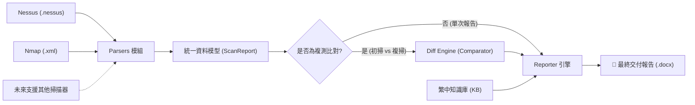

# 🕸️ VulnWeaver (弱點編織者)

<p align="center">
  <strong>專為資安健診、紅藍隊演練、ISMS 稽核與政府標案設計的弱點報告與複掃比對自動化引擎。</strong>
</p>

<p align="center">
  
  
  
  
</p>

<p align="center">
  <a href="https://nickyclin.github.io/vuln-weaver/"><strong>🌐 立即使用 Web Lite 線上版 (免安裝、純瀏覽器本地解析)</strong></a>
</p>

---

## 📖 專案緣起 (Background)

在資訊安全顧問輔導、滲透測試與資安健診實務中，工程師往往面臨以下痛點：
- **大量人工作業**：使用 Nessus、OpenVAS、Nmap 掃描後，需手動將數百筆漏洞貼至 Word/Excel 範本。
- **語言隔閡**：國際掃描器產出的漏洞描述與建議均為英文，但公部門、學校及企業**驗收強制要求全繁體中文**。
- **複測核銷困難**：政府標案必定要求「改善後複掃」，人工逐筆核對哪些已修補、哪些仍存在，極度費時且容易出錯。

**VulnWeaver** 旨在解放資安顧問與工程師的時間，將散亂的掃描檔一鍵轉化為**排版專業、支援繁體中文、具備複掃比對**的標準交付報告。

---

## 🌟 核心特色 (Key Features)

- **⚡ 掃描結果解析**
  - CLI 支援 **Tenable Nessus (`.nessus`)** 與 **Nmap XML (`-oX` 輸出的 `.xml`)**，轉成統一資料模型；OWASP ZAP 尚未支援。
  - Nmap 的開放通訊埠會列入主機清冊；只有 Telnet、過期 TLS 協定或明確回報 `VULNERABLE` 的 NSE 腳本會產生弱點項目。開放 FTP 埠本身不代表已檢出明文或匿名登入。
- **🇹🇼 繁體中文在地化知識庫 (TW Localized Knowledge Base)**
  - 內建常見弱點（如 SSL/TLS 弱演算法、預設帳密、SQLi/XSS）的繁體中文說明與符合公部門語境的修補指引。
- **🔄 殺手級複測比對 (Remediation Diff Engine)**
  - 傳入初掃（Baseline）與複測（Rescan）報告，自動比對並產出：
    - ✅ **Fixed (已修復)**：初掃存在、複掃已消失。
    - ❌ **Open (未修復)**：初掃存在且複掃仍未排除。
    - ⚠️ **New (新發現)**：初掃未檢出、複掃新出現的風險。
- **📝 Word (.docx) 報告**
  - 目前由 `python-docx` 產生標準報告；客製化範本與審核簽章功能尚未實作。
- **📊 視覺化統計圖表**
  - 自動統計「極高、高、中、低、資訊」弱點分級，並將比例圖嵌入報告。

---

## 🏗️ 系統架構 (Architecture)



---

## 📂 專案目錄結構 (Project Structure)

```text
vuln-weaver/
├── vuln_weaver/
│   ├── __init__.py           # 套件初始化與版本宣告
│   ├── models.py             # 統一資料模型 (Vulnerability, Host, ScanReport, Diff)
│   ├── cli.py                # Command Line 命令列入口 (Click + Rich)
│   ├── parsers/              # 掃描檔案解析模組
│   │   ├── __init__.py
│   │   ├── base.py           # 抽象解析器基類 (BaseParser)
│   │   ├── nessus.py         # Tenable Nessus XML 解析器
│   │   └── nmap.py           # Nmap XML 解析器
│   ├── comparator/           # 複掃比對引擎
│   │   ├── __init__.py
│   │   └── diff.py           # 初掃與複掃差異比對演算法
│   ├── reporters/            # 報表生成引擎
│   │   ├── __init__.py
│   │   ├── base.py           # 抽象報表基類
│   │   └── docx_reporter.py  # docxtpl Word 報表產出模組
│   └── templates/            # 預設 Word 範本目錄
│       └── default_tw.docx   # 台灣公部門/標準資安健診範本
├── tests/                    # 單元測試目錄
│   ├── __init__.py
│   └── test_models.py
├── .gitignore
├── pyproject.toml            # 現代化打包配置
├── requirements.txt          # Python 相依套件清單
└── README.md
```

---

## 🚀 快速上手 (Quick Start)

### 1. 安裝環境

建議使用 Python 3.10 以上虛擬環境：

```bash
# 複製專案
git clone https://github.com/NickYCLin/vuln-weaver.git
cd vuln-weaver

# 建立並啟用虛擬環境
python -m venv venv
# Windows:
.\venv\Scripts\activate
# Linux/macOS:
source venv/bin/activate

# 安裝相依套件
pip install -r requirements.txt
```

### 2. 命令列指令 (CLI Usage)

#### 單次掃描報告產出：
```bash
# 解析 Nessus 掃描檔並產生繁體中文 Word 報告
python -m vuln_weaver.cli parse sample.nessus -f docx -o report.docx

# 解析 Nmap -oX 輸出的 XML，將主機與檢出項目匯出為 JSON
python -m vuln_weaver.cli parse sample.xml -f json -o report.json
```

#### 初掃 vs 複掃比對產出：
```bash
# 比對兩次掃描結果，自動標記 Fixed / Open / New
python -m vuln_weaver.cli diff baseline.nessus rescan.nessus -o diff_report.docx
```

比對會按「弱點 ID × 主機／服務」區分狀態；同一弱點在不同主機或通訊埠可同時出現已修復、未修復或新增。初掃和複掃須來自同一掃描器、涵蓋相同主機；否則程式會拒絕產出「已修復」結論。請另外確認兩次掃描使用相同的通訊埠、服務與腳本設定，目前程式尚無法自動核對掃描設定。

---

## 🛣️ 開發路線圖 (Roadmap)

- [x] **Milestone 1**: 專案基礎骨架、資料模型設計與 CLI 框架。
- [ ] **Milestone 2**: 實作 Nessus (`.nessus`) XML 解析器與資料正規化。
- [ ] **Milestone 3**: 實作 `docxtpl` 範本引擎，匯出第一版資安健診標準 Word 報告。
- [ ] **Milestone 4**: 健全繁體中文弱點描述知識庫與修復字典。
- [ ] **Milestone 5**: 完善初掃 vs 複測比對演算法與複驗對照表輸出。
- [ ] **Milestone 6**: 支援 Nmap XML 與 Web 漏洞（OWASP ZAP / Burp Suite）。
- [ ] **Milestone 7**: 開發輕量 Streamlit Web 介面，支援拖拉即時預覽與下載。

---

## 🤝 貢獻指南 (Contributing)

歡迎提交 Pull Request 或 Issue！無論是增加新的掃描器 Parser、補充繁體中文弱點字典、或提供公家機關/企業標準報告範本，都非常感謝您的參與。

---

## 📄 授權條款 (License)

本專案採用 [MIT 授權條款](LICENSE)。
